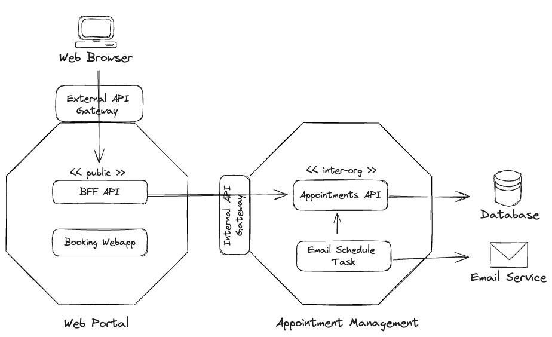

# CareConnect: Medical Appointment Booking System

CareConnect is a medical appointment booking system designed to streamline the process of scheduling healthcare appointments. It features a web interface for patients and a backend for managing appointments, including automated email reminders to ensure patients stay informed about their upcoming visits.

## Architecture Overview

CareConnect utilizes the Backend for Frontend (BFF) pattern to create a seamless connection between the frontend web application and the backend services. The architecture is divided into two primary domains:

- **Web Portal**: Handles user interactions and presents a responsive interface for appointment management.
- **Appointment Management**: Backend domain that orchestrates appointment scheduling, reminders, and database interactions.

